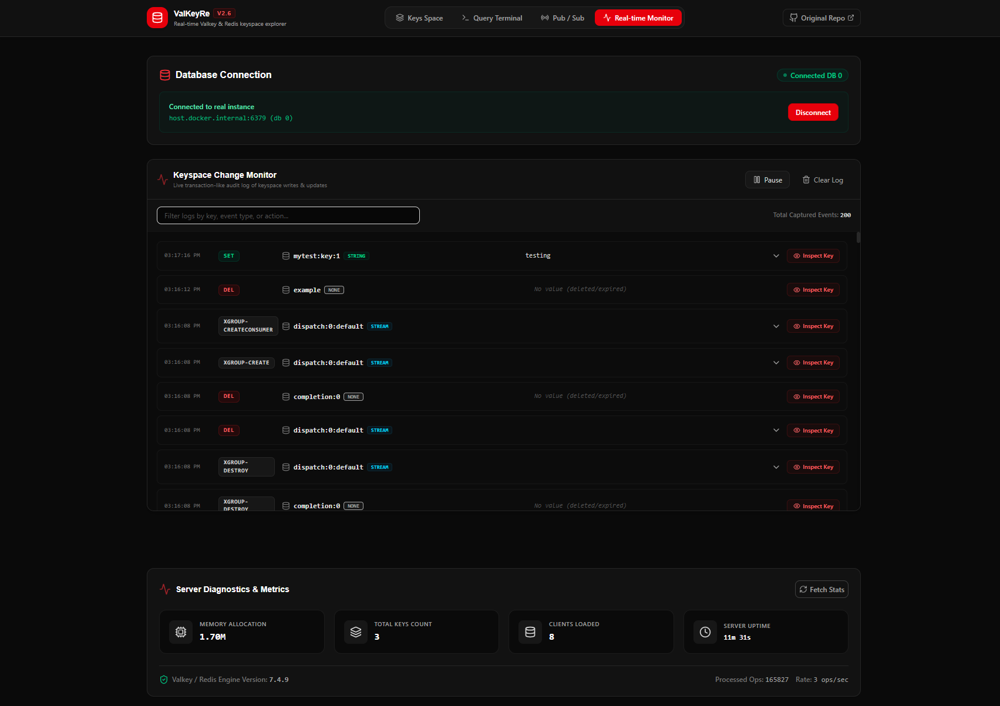

# Run and deploy ValKeyRe

This contains everything you need to run your app locally.

## Run Locally

**Prerequisites:**  Node.js

1. Install dependencies:
   `npm install`
2. Set the required API key in [.env.local](.env.local)
3. Run the app:
   `npm run dev`

## Run In Docker (via mise tasks)

1. Build the container image:
   `mise run container-build`
2. Launch the container:
   `mise run container-run`
3. Open the app:
   `http://localhost:3000`

To connect to a Redis/Valkey instance running on your host machine from inside the container, use:
- Host: `host.docker.internal`
- Port: your Redis/Valkey port (commonly `6379`)
